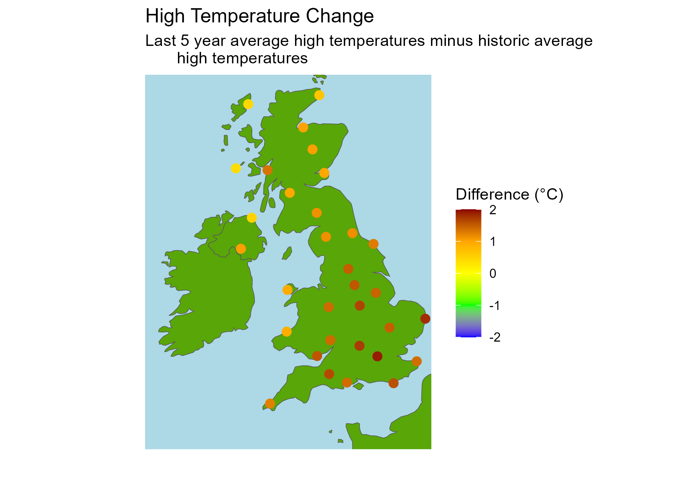
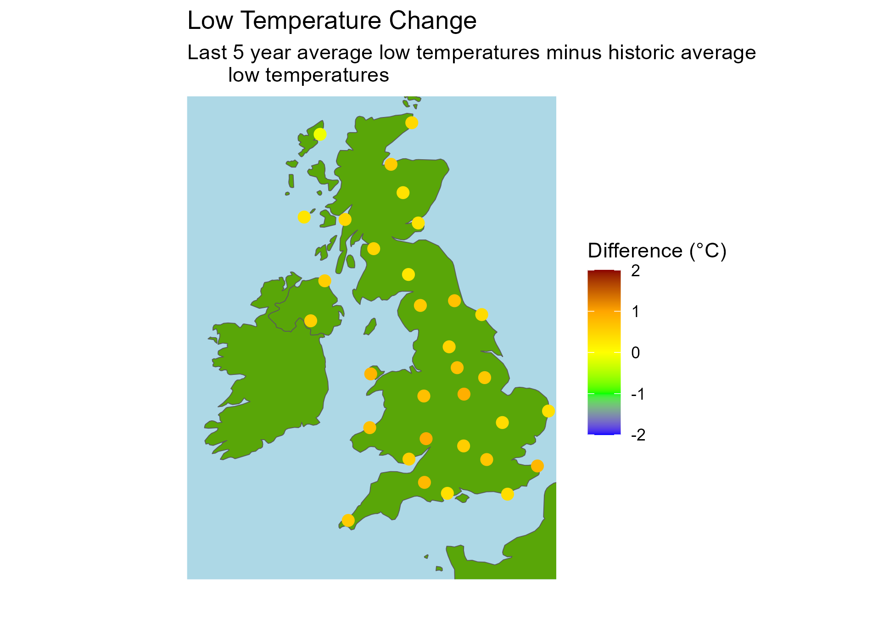

# uk_climate_analysis
Analysis of UK MET office station readings to answer questions on climate change.

# Introduction
Living in the UK and remembering childhood winters playing in the snow, it often *feels* like the climate has changed notably since these memories around 35 years ago. The last time I remember my own children playing in the snow was several years ago at Easter. They built an Easter Bunny Snowman rather than the typical kind that I remember building as a child around Christmas.

My news feeds are filled with unprecedented climate related events such as floods and wildfires around the globe. It certainly *appears* to me like the climate has changed rapidly in recent years. But is this just my perception or is there any evidence of this change?

In order to determine how the climate has changed in the UK since my childhood, this project analyses the [Met Office Historical Staton Data](https://www.metoffice.gov.uk/research/climate/maps-and-data/historic-station-data).

# Conclusion
The full report is available [here](report.html). In summary:

The seasons are shifting with the average winter temperature trending higher and the average spring temperatures trending lower. Although there are instances of recent cold winters and hot springs, the trend lines crossed their averages around 1945 for winter and 1910 for spring and the rate of change is increasing.

All regions in the UK are getting hotter. The highest average daily temperatures have increased across all regions when comparing the last 5 years to all years since 1978. We are also getting warmer coldest days, but not to the same extent, with the lowest average daily temperatures increasing marginally across all regions with the exception of Stornaway Airport.

The UK is getting wetter across the majority but not all regions.

