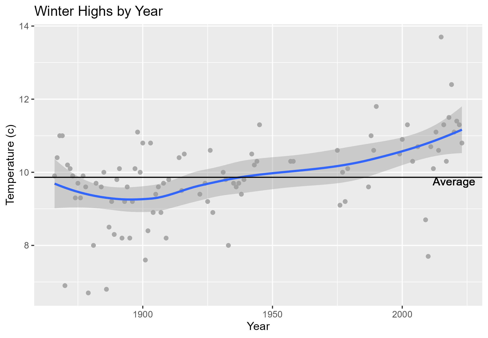
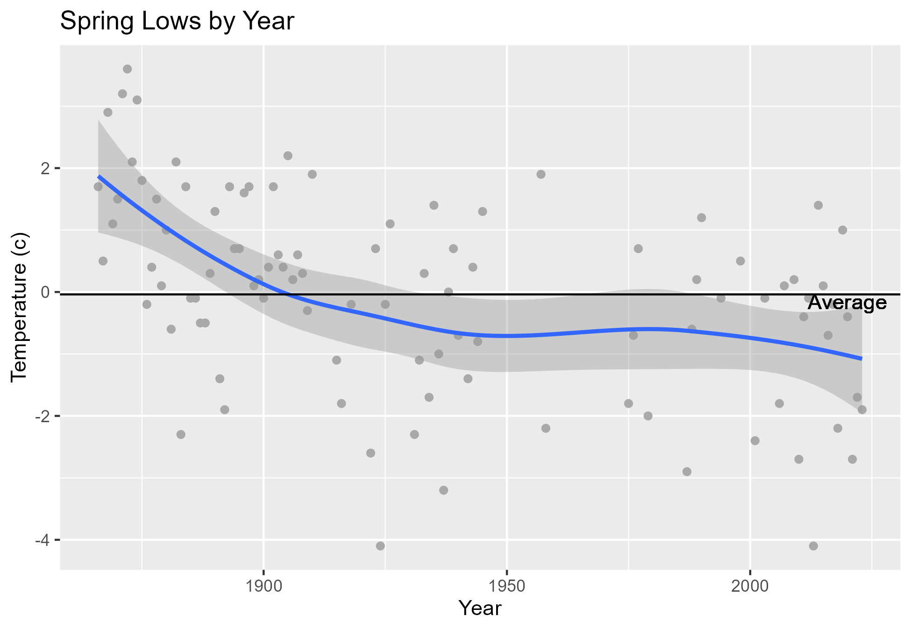

```{r setup, include=FALSE}
knitr::opts_chunk$set(echo = TRUE)
```

```{r load packages, include=FALSE}
library("tidyverse")
```

# Introduction

Living in the UK and remembering childhood winters playing in the snow, it often *feels* like the climate has changed notably since these memories around 35 years ago. The last time I remember my own children playing in the snow was several years ago at Easter. They built an Easter Bunny Snowman rather than the typical kind that I remember building as a child around Christmas.

{width=200}.

My news feeds are filled with unprecedented climate related events such as floods and wildfires around the globe. It certainly *appears* to me like the climate has changed rapidly in recent years. But is this just my perception or is there any evidence of this change?

In order to determine how the climate has changed in the UK, this report analyses the [Met Office Historical Staton Data](https://www.metoffice.gov.uk/research/climate/maps-and-data/historic-station-data) to answer the following questions :

## Have the seasons shifted?

* Is the average highest temperature for December, January and February across all UK locations for the last 5 years higher than the  historical average?
* Is the average lowest temperature for March, April and May across all UK locations for the last 5 years lower than the  historical average?

## Are we gettig higher temperature peaks?

* For each location, is the average highest annual temperature over the last 5 years higher than the historical average?

## Are we getting lower temperature dips?

* For each location, is the average lowest annual temperature over the last 5 years lower than the historical average?

## Are we getting more or less rainfall?

* For each location, is the average yearly rainfall for the last 5 years lower than the historical average?
* For each location, is the average yearly rainfall for the last 5 years higher than the historical average?

# Conclusion

The seasons are shifting with the average winter temperature over the last 5 years 1.68$^\circ$c higher than the average winter temperature across all years since 1865, and the average spring lowest temperature -1.16$^\circ$c lower for the same period.




All regions in the UK are getting hotter. The highest average daily temperatures for each year have increased between 0.39$^\circ$c and 1.9$^\circ$c across all regions when comparing the last 5 years to all years since 1978. We are also getting hotter coldest  days, with the lowest average daily temperatures for each year having decreased across all weather stations except for Stornaway Airport.


The UK is getting wetter across the majority but not all regions.


# Approach

1) Data was retrieved from the MET Office website and prepared for analysis. The preparation steps are shown in [Appendix I](prepare.html). The prepared data is available [here](met_station_readings.csv).
2) The prepared data was then processed to create two summary datasets: i) Seasonal high, low, average max and average min temperature across all weather stations by year; and ii) Annual high, low and total rainfall by station by year. The processing steps are shown in [Appendix II](process.html).
3) Averages were added to the [annual temperatures by station](annual_station_summary.csv) summary data and graphs were plotted against both summary datasets in order to answer the questions. The analysis steps are shown in [Appendix III](analysis.html). 


